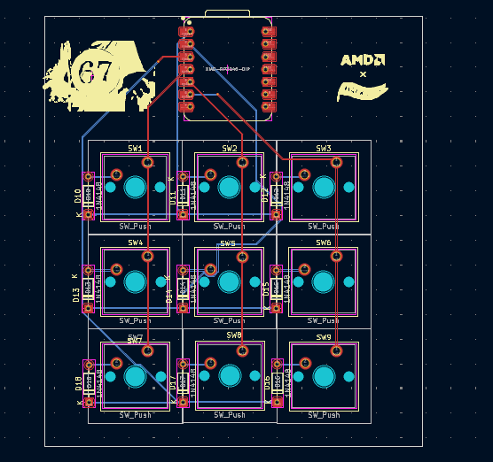
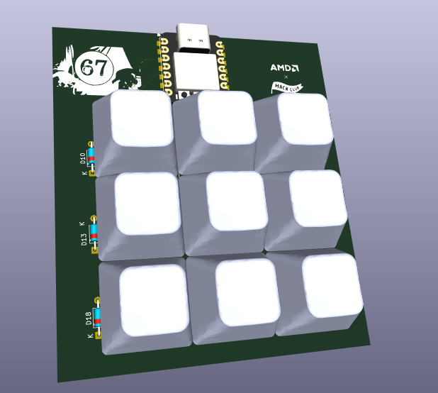
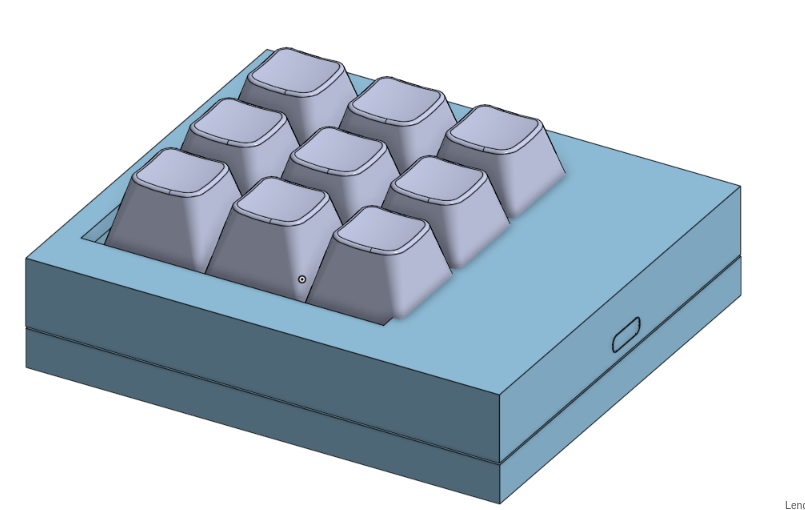

# Macropad-67

A compact custom macropad designed for learning and experimentation in PCB design and CAD.

## Tools Used

* **KiCad** – schematic capture, PCB layout, and 3D PCB visualization
* **Onshape** – enclosure and mechanical CAD design

## Project Overview

* Custom PCB designed in KiCad
* Custom footprints used for components
* Enclosure modeled and assembled in Onshape
* Intended as a beginner-to-intermediate hardware project

## Images

**PCB Footprint**

**PCB 3D View**

**CAD Assembly**

## Status

Hardware design complete. Firmware and testing in progress.

